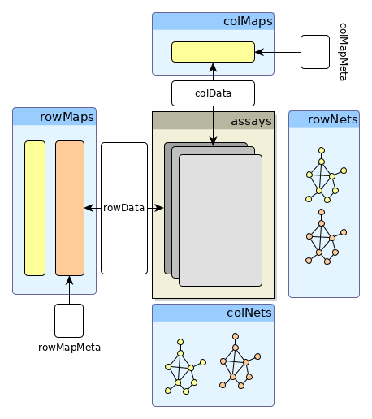

# ACTIONetExperiment (ACE) Package
ACTIONetExperiment is the extension of [SummarizedExperiment](https://bioconductor.org/packages/release/bioc/html/SummarizedExperiment.html) class specifically designed to match the structure of Python [AnnData](https://anndata.readthedocs.io/en/latest/) objects. It is originally developed to accompany the [ACTIONet](https://github.com/shmohammadi86/ACTIONet/tree/R-release/) R package.



## Installation
### Setting Up the Environment (Preinstallation)
**For Linux Users** 
```bash
sudo apt install libhdf5-dev
```

**For Mac Users** 

```bash
brew install hdf5
```

### Installing ACTIONetExperiment
```r
install.packages("devtools")
devtools::install_github("shmohammadi86/ACTIONetExperiment")

```
