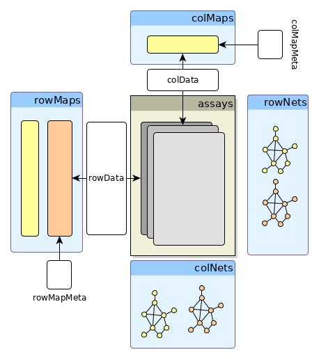

# ACTIONetExperiment (ACE) Package
ACTIONetExperiment is the extension of [SummarizedExperiment](https://bioconductor.org/packages/release/bioc/html/SummarizedExperiment.html) class specifically designed to match the structure of Python [AnnData](https://anndata.readthedocs.io/en/latest/) objects. It was originally developed to accompany the [ACTIONet](https://github.com/shmohammadi86/ACTIONet/tree/R-release/) R package, but functions as a stand-alone package for omics data storage and manipulation. `ACTIONetExperiment` objects can be used interchangeably with `SummarizedExperiment` or `SingleCellExperiment` objects in most packages.



## Installation
### Setting Up the Environment (Preinstallation)
**For Linux Users** 
```bash
sudo apt install libhdf5-dev
```

**For Mac Users** 

```bash
brew install hdf5
```

### Installing ACTIONetExperiment
```r
install.packages("devtools")
devtools::install_github("shmohammadi86/ACTIONetExperiment")
```

Or from a clone:

```bash
git clone https://github.com/shmohammadi86/ACTIONetExperiment.git
R CMD INSTALL ACTIONetExperiment
```

## Quick start

```r
library(ACTIONetExperiment)

counts <- matrix(rpois(2000, 3), nrow = 100, ncol = 20,
                 dimnames = list(paste0("gene", 1:100), paste0("cell", 1:20)))
ace <- ACTIONetExperiment(assays = list(counts = counts))

# Column-wise reductions, embeddings, and networks are first-class slots
colReductions(ace)$PCA  <- prcomp(t(counts))$x[, 1:10]
colEmbeddings(ace)$UMAP <- matrix(rnorm(20 * 2), nrow = 20)

# ACE objects coerce to and from the containers other packages expect
sce <- as(ace, "SingleCellExperiment")
ace <- as(sce, "ACTIONetExperiment")
```

## What ACE adds

Beyond `SummarizedExperiment`, ACE carries paired row and column containers:

| Accessor | Holds |
| --- | --- |
| `rowMaps` / `colMaps` | Arbitrary gene-wise and cell-wise matrices |
| `rowReductions` / `colReductions` | Dimensionality reductions |
| `rowEmbeddings` / `colEmbeddings` | 2D and 3D embeddings for visualisation |
| `rowNets` / `colNets` | Gene-gene and cell-cell networks |
| `rowMapTypes` / `colMapTypes` | The kind of each map, which is what separates reductions from embeddings |
| `rowMapMeta` / `colMapMeta` | Per-map metadata |

## Importing data

| Function | Source |
| --- | --- |
| `import.ace.from.10X` | 10x Genomics output directory |
| `import.ace.from.10X.h5` | 10x HDF5 file |
| `import.ace.from.counts` | A raw count matrix |
| `import.ace.from.table` | A delimited text file |
| `import.ace.from.loom` | Loom file |
| `import.ace.from.Seurat` | Seurat object |
| `import.ace.from.CDS` | Monocle CellDataSet |

## Citation

ACE was developed as part of the ACTIONet framework:

> Mohammadi, S., Davila-Velderrain, J., & Kellis, M. (2020).
> **A multiresolution framework to characterize single-cell state landscapes.**
> *Nature Communications*, 11, 5399.
> https://doi.org/10.1038/s41467-020-18416-6

`CITATION.cff` is included, so GitHub's "Cite this repository" button will
generate BibTeX and APA entries.

## License

GPL (>= 2); see [LICENSE.md](LICENSE.md).

## Contributing

Bug reports and pull requests are welcome via
[GitHub issues](https://github.com/shmohammadi86/ACTIONetExperiment/issues).
